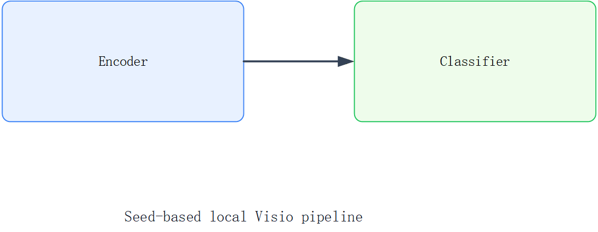

# codex-editable-visio-figures

A Codex skill for building editable paper figures with local Microsoft Visio on Windows.

This project is designed for a practical workflow:

- use a local Visio desktop installation;
- start from a known-good seed `.vsdx` file;
- generate or revise figures from a JSON drawing spec;
- export `.png` and `.pdf` deliverables from the saved Visio source.

## Preview



## What this skill is for

Use this skill when you want Codex to help with:

- building paper figures in local Visio;
- revising an existing `.vsdx` figure;
- converting a structured layout idea into editable Visio shapes;
- exporting preview or submission-friendly outputs;
- keeping the final figure editable instead of flattening everything into one image.

## Why the workflow is seed-based

On this machine class, creating a brand-new Visio file from scratch through COM was less reliable than opening and modifying an existing `.vsdx`.

So this skill uses a **seed `.vsdx` workflow**:

1. keep a small working seed file under `assets/seed-paper-figure.vsdx`;
2. copy that seed to a new target file;
3. draw or revise the figure through COM automation;
4. export `.png` / `.pdf` from the saved document.

That makes the automation much more stable for real use.

## Project structure

```text
visio-local-paper-figure-skill/
|- SKILL.md
|- README.md
|- .gitignore
|- agents/
|  |- openai.yaml
|- assets/
|  |- seed-paper-figure.vsdx
|- docs/
|  |- preview.png
|- examples/
|  |- example-spec.json
|- python/
|  |- build_figure.py
|- references/
|  |- workflow.md
|  |- spec-schema.md
|- scripts/
|  |- visio_probe.ps1
|  |- launch_visio.ps1
|  |- visio_apply_spec.ps1
|  |- visio_export.ps1
```

## Python wrapper

A lightweight Python entrypoint is included for users who prefer a Python-first CLI while keeping PowerShell as the stable Windows/Visio backend.

```powershell
python .\python\build_figure.py probe

python .\python\build_figure.py export --vsdx .\assets\seed-paper-figure.vsdx --formats png pdf

python .\python\build_figure.py build --spec .\examples\example-spec.json --output .\output\figure1.vsdx --formats png pdf --replace-page
```

## Scripts

### 1. Probe the local Visio environment

```powershell
powershell -ExecutionPolicy Bypass -File .\scripts\visio_probe.ps1
```

### 2. Export from an existing `.vsdx`

```powershell
powershell -ExecutionPolicy Bypass -File .\scripts\visio_export.ps1 \
  -VsdxPath .\assets\seed-paper-figure.vsdx \
  -OutputDir .\tmp_exports \
  -Formats png,pdf
```

### 3. Build a figure from a JSON spec

```powershell
powershell -ExecutionPolicy Bypass -File .\scripts\visio_apply_spec.ps1 \
  -SpecPath .\examples\example-spec.json \
  -VsdxPath .\output\figure1.vsdx \
  -SeedVsdxPath .\assets\seed-paper-figure.vsdx \
  -OutputDir .\output\exports \
  -ExportFormats png,pdf \
  -ReplacePage
```

## JSON spec

See [references/spec-schema.md](references/spec-schema.md).

The current implementation supports these shape types:

- `rect`
- `ellipse`
- `text`
- `line`
- `connector`

A runnable example spec is included at:

- [examples/example-spec.json](examples/example-spec.json)

## Notes

- The `.vsdx` file is the source of truth.
- Exported `.png` and `.pdf` files are derived outputs.
- This skill is built for **local Windows + Visio COM** rather than cloud rendering.
- For very fine visual polish, a second-pass manual Visio edit may still be useful.

## Requirements

- Windows
- Microsoft Visio desktop installed locally
- PowerShell available
- Python 3.9+ for the wrapper CLI

The Python wrapper itself uses only the standard library; see [requirements.txt](requirements.txt).
Visio COM automation also requires a usable interactive Windows desktop/logon session; headless or expired sessions may fail the probe even when Visio is installed.

## Validation status

This project was validated on the local machine with a successful end-to-end flow that produced:

- a new `.vsdx` output file;
- a `.png` export;
- a `.pdf` export.

## Suggested next improvements

- add grouped-shape support;
- add image-to-spec assistance for paper figure reconstruction;
- add a higher-level wrapper command for one-shot figure generation;
- add optional live Visio UI refinement guidance after the scripted draft is created.

